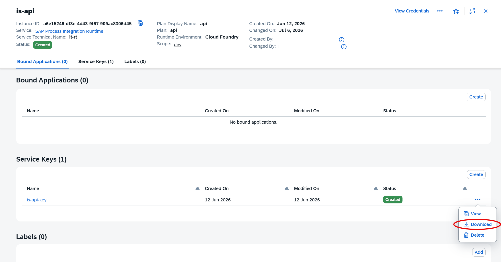

# btpis

btpis is a command-line tool for working with SAP BTP Integration Suite artifacts from the terminal. It provides a lightweight workflow for configuring OAuth credentials, listing integration packages and flows, retrieving flow details, deploying integration flows, and viewing logs.

## Features

- Configure and manage OAuth profiles for SAP BTP Integration Suite
- List packages, integration flows, service endpoints, and configurations
- Retrieve detailed information about a single integration flow
- Deploy a single integration flow or a batch from a CSV file
- View recent or streamed integration flow logs

## Requirements

Before using the CLI, make sure you have:

- Node.js 18+ and npm
- Access to an SAP BTP Integration Suite environment with valid OAuth credentials


## Installation

### From npm

The package is published to npm, you can install it with:

```bash
npm install -g btpis@latest
```

## Configuration

The CLI stores OAuth configuration in a JSON file under your user config directory. You can create a profile from a JSON file containing the required properties. Download the API service key from the tenant:


Example profile file:

```json
{
  "createdate": "2026-01-01",
  "clientid": "your-client-id",
  "clientsecret": "your-client-secret",
  "tokenurl": "https://example.authentication.us10.hana.ondemand.com/oauth/token",
  "url": "https://example.it-cpna.ondemand.com"
}
```

Create and register a profile:

```bash
btpis config set dev ./oauth-config.json
```

List configured profiles:

```bash
btpis config list
```

Set a default profile:

```bash
btpis config set-default dev
```

## Usage

### 1. List packages and integration flows

```bash
btpis list packages
btpis list iflows --all
btpis list service-endpoints
btpis list configurations
```

### 2. Get details for an integration flow

```bash
btpis get iflow <id> <version>
```

Example:

```bash
btpis get iflow MyFlow 1.0
```

Include configuration parameters and resources:

```bash
btpis get iflow MyFlow 1.0 --configurations --resources
```

### 3. Deploy an integration flow

Deploy a single integration flow:

```bash
btpis deploy iflow <id> <version>
```

Example:

```bash
btpis deploy iflow MyFlow 1.0
```

Deploy a batch from CSV:

```bash
btpis deploy bulk ./deploy.csv
```

Example CSV:

```csv
id,version
MyFlow,1.0
AnotherFlow,2.3
```

### 4. View logs

Show the most recent log entries:

```bash
btpis logs
```

Show logs for a specific integration flow:

```bash
btpis logs MyFlow --tail 50
```

Show logs from a relative time range:

```bash
btpis logs MyFlow --since 1h
```

Follow logs continuously:

```bash
btpis logs MyFlow --follow
```

## Build and release

### Build the native binary for the current platform

```bash
npm run build:native
```

### Build for specific targets

```bash
npm run build:windows
npm run build:linux
npm run build:macos
```

### Build all supported targets

```bash
npm run build:all-platforms
```

### Release workflow

```bash
npm run release
```

This runs version sync, builds the Windows artifact, and publishes the package.

## Project structure

- `cli/` contains the Rust CLI implementation
- `bin/` contains the Node wrapper and bundled native binaries
- `scripts/` contains helper scripts for version sync and install-time behavior
- `docker/` contains build containers for cross-platform builds

## Troubleshooting

- If the CLI cannot find the native binary, rebuild it with `npm run build:native`.
- If authentication fails, verify the profile JSON and the SAP BTP OAuth endpoint values.
- If deployment requests are rejected, confirm that the integration flow ID and version are valid for the target environment.

## License

This project is licensed under the Apache 2.0 License.
